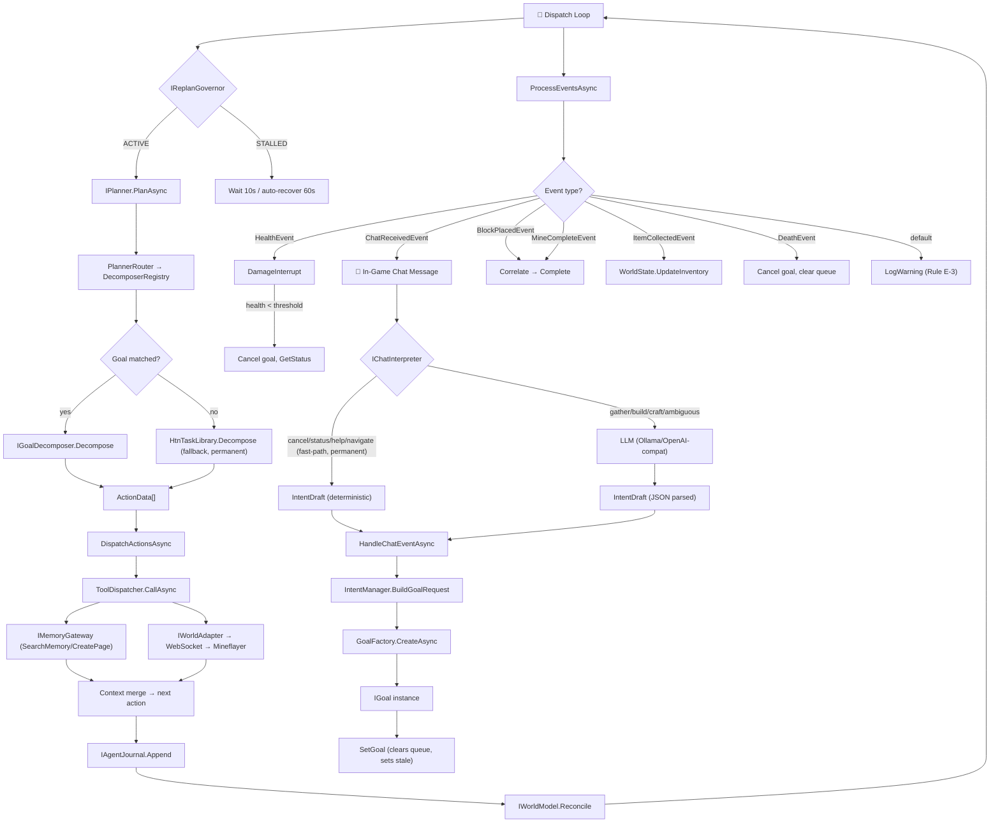

# Architecture

MemorySmith.Agent is structured as three bounded contexts plus interface bridges. This keeps Minecraft-specific code isolated in the adapter module while higher-level agent logic remains game-agnostic.

## Bounded Contexts

| Context | Projects | Responsibility |
|---|---|---|
| **Agent Core** | `Agent.Core`, `Agent.Planning`, `Agent.Personality`, `Agent.Tools` | Goals, planning, memory use, tool invocation, action queue, journal, world model. The "brain". |
| **MemorySmith (Knowledge)** | external — `TheMasonX/MemorySmith` | Persistent wiki pages (facts, plans, blueprints), hybrid search (BM25 + embeddings), REST/MCP API. |
| **World Adapters** | `Agent.World.Minecraft`, `MineflayerAdapter/` | Exposes world state and executes low-level actions. Swappable without changing agent logic. |

Plus supporting projects:

| Project | Responsibility |
|---|---|
| `Agent.Vision` | ISpatialAnalyzer, aesthetic analysis via vision models (Phase 4) |
| `Agent.Construction` | IArchitect, IBlueprintRepository, blueprint schema |
| `WebUI.Blazor` | Blazor Server dashboard, SignalR real-time updates, REST control API, DI root |
| `MemorySmith.Agent.Tests` | NUnit tests — 200+ passing |

## Key Interfaces

```
IAgent                  — top-level agent lifecycle (Run, SetGoal, Stop)
IGoal                   — goal evaluation (IsComplete, HasFailed, FailureReason, DamageInterruptThresholdHp)
IPlan                   — ordered action sequence from planner
IMemoryGateway          — MemorySmith search/read/write
ITool                   — MCP tool (Name, Description, InputSchema, Execute)
IWorldAdapter           — world comms (Connect, SendAction, ReceiveEvents)
IPlanner                — HTN plan generation, replanning (Sprint 28: ReplanAsync accepts optional originalGoal)
IAgentJournal           — append-only bounded event ring (1000 entries, 11 event types)
IWorldModel             — observe/predict/reconcile/uncertainty for world state
IGoalDecomposer         — pluggable goal decomposition (CanHandle + Decompose)
IReplanGovernor         — stall detection (ACTIVE/STALLED states, inventory-delta progress)
IChatInterpreter        — Minecraft chat → agent intent (pattern-first, LLM fallback)
ISpatialAnalyzer        — environmental metric computation (Phase 4)
IVisionModel            — multimodal aesthetic critique (Phase 4)
IArchitect              — blueprint generation from style requirements
IBlueprintRepository    — blueprint CRUD backed by MemorySmith pages
```

## Runtime Flow (Canonical — Sprint 50)

This is the **single authoritative pipeline** as of Sprint 50. It replaces the conflicting
descriptions that previously existed in `architecture.md` (deterministic HTN), `AGENTS.md`
(LLM-first), and `chat-system.md` (hybrid). The pipeline is LLM-first for chat interpretation
but deterministic-first for goal decomposition — both are intentional per ADR D-003.



**Key design decisions reflected in this diagram:**

1. **LLM-first for chat** (Sprint 35+): All gather/build/craft intents go through the LLM. CreateGoal fast-paths were removed in Sprint 35 P1-B per CRITICAL Rule A-1.
2. **Deterministic fast-paths are permanent** (ADR D-003, Sprint 43): cancel, status, help, and navigate intents use regex fast-paths. These are zero-risk and never touch the LLM.
3. **Deterministic-first for decomposition** (ADR D-003): Goal decomposition uses `IGoalDecomposer` registry; `HtnTaskLibrary` is the permanent catch-all fallback. No LLM is involved in decomposition.
4. **Context carry** (Sprint 25+): SearchMemoryTool writes coordinate hints to `ActionData.Context`; MoveToTool reads `nearestX/Y/Z` when explicit coords are absent. This bridge is temporary (see Compatibility Bridge Registry).
5. **Rule E-3 compliance** (Sprint 51): Every `switch` on event type has a `default:` branch that logs the unhandled type. No events are silently discarded.

## Dual Memory Gateway

Since Sprint 22, two `IMemoryGateway` instances are registered:

| Key | Purpose | Default URL |
|-----|---------|-------------|
| (default) | Agent KB — codebase, guides, architecture | `http://localhost:5001` |
| `"world"` | World KB — world facts, exploration log | `WorldKbUrl` (null = disabled) |

Tool routing (Sprint 23):
- `SearchMemoryTool`, `CreatePageTool` → World KB (world facts and events)
- `GetPageTool` → Agent KB (codebase knowledge and guides)

## Agent Safety Systems

**Damage Interrupt (Sprint 23):** `ProcessEventsAsync` synthesizes `DamageTakenEvent` from consecutive health deltas. When health drops below `DamageInterruptThresholdHp` (default 6 HP), `TryInterruptOnDamage` atomically clears the action queue and enqueues `GetStatus`. Per-goal override possible (0 = never interrupt). 3s cooldown prevents thrash.

**Replan Governor (Sprint 19–20):** `ReplanGovernor` tracks plan fingerprints and inventory changes. Three identical fingerprints with no inventory delta → STALLED. During STALL: 10s delay, no `PlanAsync`, auto-recovery after 60s.

**Inventory Freshness (Sprint 21–22):** `WorldState.IsInventoryStale` is set on `SetGoal` and cleared when `ApplyStatus` processes a `GetStatus` result. `GenericGatherGoal.IsComplete` and `CraftItemGoal.IsComplete` return false when stale, preventing false completion after admin `/clear`.

**Tool Validation (Sprint 5):** `ToolDispatcher.CallAsync` checks all args against `ITool.InputSchema` (type/required/properties) before execution. Unknown tool names are rejected at the `/api/agent/command` endpoint.

## Agent Journal Semantics

The `AgentJournal` (implementing `IAgentJournal`) is a **bounded diagnostic buffer**, not a durable event store.

Key properties:
- Maximum 1000 entries (bounded `ConcurrentQueue` with best-effort trim under concurrency — see Sprint 6 council B1/B2 fixes)
- In-process memory only — entries do not survive process restart
- Entries are diagnostic: they help operators understand recent agent decisions but must not be used for business logic or auditing
- 11 event types: `GoalSet`, `GoalCancel`, `PlanCreated`, `ActionDispatched`, `ActionCompleted`, `ActionFailed`, `ReplanTriggered`, `AgentStarted`, `AgentStopped`, plus validation/execution events from `ToolDispatcher`

For **persistent memory** (learning, world observations, agent KB), use the MemorySmith REST API via `IMemoryGateway`.

This section closes Deep Code Audit Finding 4 from Sprint 25 external audit (Sprint 28 P1-C).

## Design Principles

**Deep modules**: each module has a small interface that hides significant complexity. `MoveToTool` encapsulates pathfinding internals — the LLM only sees `MoveTo(x, y, z)`.

**Deterministic first** (ADR D-003): LLM is used sparingly. `CraftRegex` resolves "craft an iron pickaxe" without touching Ollama. All sub-task decomposition runs deterministically; LLM is fallback for novel/ambiguous goals.

**Single-host model (WebUI.Blazor)**: the Blazor app hosts the REST API, SignalR hub, and agent loop in one process. No separate queue, database, or broker.

**Game-agnostic agent logic**: only `Agent.World.Minecraft` knows about Mineflayer. A future `Agent.World.Factorio` adapter implements `IWorldAdapter` and plugs in without changes to the planner or tool engine.

**No magic numbers** (AGENTS.md): all timeouts, radii, TTLs are named constants or `*Options` properties. `TreatWarningsAsErrors=true` in `Directory.Build.props`.

## Compatibility Bridge Registry (Sprint 51)

Every backward-compatibility path, fallback, and transitional shim is classified here.
This registry gates Sprint 52 monolith extraction: no extraction begins until every bridge
has an owner, a target sprint for removal/replacement, and explicit removal criteria.

| Bridge | Location | Classification | Owner | Purpose | Replacement | Removal Criteria | Target Sprint |
|:-------|:---------|:--------------|:------|:--------|:-----------|:----------------|:--------------|
| **Context-carry (nearestX/Y/Z)** | `MoveToTool.cs` | **Temporary** | Planning | `SearchMemoryTool` writes coordinate hints into `ActionData.Context`; `MoveToTool` reads `nearestX/Y/Z` as fallback when explicit `x/y/z` args are absent. Avoids requiring the planner to always emit explicit coordinates. | `SearchMemory→MoveTo` routing in `IPlanningManager` (Sprint 52). Planner will emit explicit coordinates from memory search results directly. | Integration tests pass with explicit-coordinate-only MoveTo; context-carry keys deprecated for 1 sprint then removed. | S53 |
| **Context-key merge (dispatch loop)** | `AgentBackgroundService.cs` (~line 1130) | **Temporary** | Planning | `DispatchActionsAsync` merges `ActionData.Context` keys into tool arguments for the next action in the sequence. This is how SearchMemoryTool's `nearestX/Y/Z` reach MoveToTool. | Replace with typed `PlanContext` (Sprint 52 Phase 1). Context merge becomes explicit `context.ToArguments(toolSchema)` call. | `PlanContext` type introduced; context merge in dispatch loop removed. | S52 |
| **LLM fast-paths (cancel/status/help/navigate)** | `LlmChatInterpreter.cs` | **Permanent** | Chat | Deterministic regex fast-paths for cancel, status, inventory, help, and navigate intents. These never touch the LLM and are intentional per ADR D-003 (Deterministic First). Sprint 35 removed the CreateGoal fast-path; navigate was re-added in Sprint 43. | None — permanent by design. | N/A | N/A |
| **LlmChatInterpreter → IntentManager transition layer** | `AgentBackgroundService.cs` `IntentDraftToGoal` | **Temporary** | Planning | Maps `IntentDraft` to `GoalRequest` via `IntentManager.BuildGoalRequest`. The `IntentDraftToGoal` method is a transitional shim until all goal mapping moves into `IIntentManager`. | `IIntentManager.BuildGoalRequest` called directly from `HandleChatEventAsync`. | `IntentDraftToGoal` private method removed; all callers use `IIntentManager`. | S52 |
| **HTN fallback decomposer (`HtnPlanner`)** | `HtnPlanner.cs`, `HtnTaskLibrary.cs` | **Permanent** | Planning | HTN planner is the fallback decomposition engine. When no `IGoalDecomposer` handles a goal, `HtnTaskLibrary.Decompose` provides the plan via hardcoded action sequences. | None — permanent. New decomposers are added via `IGoalDecomposer`; HTN remains the catch-all. | N/A | N/A |
| **`ChatInterpretation` + `GoalName`** | `ChatModels.cs` | **Removed (Sprint 44)** | Chat | `ChatInterpretation` record with `GoalName` field was the pre-Sprint-35 path where the parser directly created goals (violated CRITICAL Rule A-1). Removed in Sprint 44 P1-1. All callers now use `IntentDraft`. | Already removed. | N/A (complete). | S44 ✅ |
| **`_agentRuntime` field (unused)** | `AgentBackgroundService.cs:138` | **Obsolete** | Runtime | `AgentRuntime?` field was injected for Sprint 39 decomposition but is unreferenced in ~2300 lines. Either dead code from an incomplete migration or future plumbing. | Integrate or remove. If unused by Sprint 52, remove field and constructor parameter. | Field removed OR integrated in `IAgentRuntime` decomposition. | S51 (TSK-0126) |
| **`ActionData.Arguments` dict mutability** | `HtnTaskLibrary.cs` `MakeAction` | **Temporary** | Planning | `MakeAction` returns `ActionData` with a mutable `Arguments` dictionary. Consumers can modify it after construction. | Freeze dictionary after construction or clone before mutation. | All `MakeAction` callers use immutable arguments. | S51 (TSK-0135) |

### Classification Legend

- **Permanent**: intentional design decision, no removal planned. ADR-backed.
- **Temporary**: transitional shim with a known replacement and target sprint for removal.
- **Obsolete**: dead code or zombie field with no current function. Should be removed.
- **Removed**: already eliminated in a prior sprint. Retained here for historical reference.
